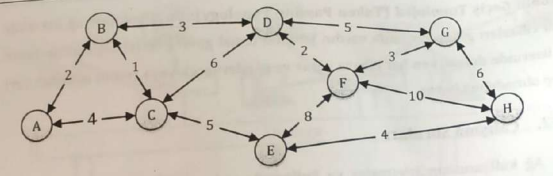

# 1. Çalışma Soruları

### 1. Ağ kullanımının işletmeler ve kullanıcılar için sağlamış olduğu avantajlar nelerdir?

    -

### 2. Paralel iletim ile seri iletim arasındaki fark nedir?

### 3. Seri iletim kullanan bir ağın bant genişliği 100Mbps olduğuna göre 2GB boyutundaki bir veri ne kadar sürede iletilir?

### 4. Veri transferi yapılırken eşlik biti ne için kullanılır?

### 5. 1101101 şeklindeki bir veri iletilmek istendiğinde eşlik bitinin nasıl bir etkisi vardır?

### 6. BaseBand ve BroadBand kavramlarını açıklayarak günlük hayattan kullanım örnekleri veriniz.

### 7. İnce koaksiyel kablo kullanılarak oluşturulan bir ağda hangi ağ bileşenleri ve konnektörler bulunmak zorundadır?

### 8. 10 Base2 bir ağda koaksiyel kabloya bağlanacak bir bilgisayar T-konnektörden 2 metre uzatma yapılarak bağlanabilir mi?

### 9. UTP kablo kullanılarak oluşturulan bir ağda kablo içerisindeki 8 hattın hepsinin kullanım zorunluğu var mıdır, örneğin yarısı kullanılabilir mi?

### 10. Ağlarda kullanılan kabloların çalışma frekanslarının hız üzerine nasıl bir etkisi vardır?

### 11. Fiber tipine göre fiber optik kablo türleri nelerdir?

### 12. Fiber optik kablolar üretim malzemesine göre kaç gruba ayrılır?

### 13. Devre anahtarlama ile paket anahtarlama arasındaki temel fark nedir?

### 14. Paket anahtarlamalı ağlarda yönlendirmenin temel amacı nedir? Statik ve dinamik yönlendirmenin farkı nedir?

### 15. Aşağıdaki şekilde örnek bir ağ yapısı verilmiştir. Yollar üzerinde verilen değerler yolların hem gidiş hem de dönüş için yol maliyetleridir. Bu bilgileri doğrultusunda aşağıda verilen soruları cevaplandırınız.

    a) Ağ üzerindeki her bir yönlendiricinin üzerinde bulunan yönlendirme düğümlerini (hedef, sonraki) yazınız.

    b) B düğümünden G düğümüne bir veri gönderilmek istendiğinde kullanılabilecek en kısa 3 yolu bulunuz.

    c) Dijkstra algoritması ile A ve H arasındaki en kısa yolu bulunuz.

    d) Bellman-Ford algoritması ile A ve H arasındaki en kısa yolu bulunuz.

    e) Bir veri C’den G’ye taşıma algoritması ile gönderildiğine göre izleyeceği yolları gösteriniz.

    f) Her bir yol için kendiniz hat kapasitesi belirleyerek (bps) ortalama paket uzunluğa 500bit/paket olan verinin akış durumu yönlendirme algoritmasına göre iletilmesi planlanmaktadır. Her bir yolun ortalama paket gecikmesinin bulunuz.

### 16. 2-tier ve 3-tier mimarilerin farkı nedir?

### 17. Coğrafi açıdan ağ türleri nelerdir? Bu ağ türlerini büyüklüklerine göre sıralayınız.

### 18. Fiziksel ağ topolojilerini hız, mesafe ve maliyet değerlerine göre kıyaslayınız.
