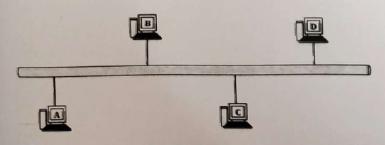
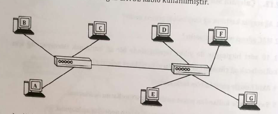

# 2. Çalışma Soruları

### 1. Ağ arayüz kartının ağ üzerindeki görevi nedir?

### 2. MAC adresi ne için kullanılır?

### 3. 10 adet bilgisayar ile yıldız topolojisinde bir ağ kurulmak isteniyor. Ağ için kullanılacak ağ cihazları ve kabloların özellikleri nelerdir?

### 4. Aktif hub ile pasif hub'ın farkı nedir?

### 5. Switchlerde kullanılan paket anahtarlama modlarını açıklayınız.

### 6. Hub ile switch arasındaki performans farklarının nedenini açıklayınız.

### 7. Hub ile repeater arasında fark var mıdır?

### 8. 3000 m^3'lik bir alanda ağ kurulamk ve internete bağlantı isteniyor. Ağ cihazlarının arasındaki mesafe maksimum 250 metre ve ağda kablosuz olarak kullanılacak cihazlar da var ise oluşturulacak ağ için kullanılacak ağ donanımları nelerdir?

### 9. Aşağıdaki şekilde verilen ağda ince koaksiyel kablo kullanılmıştır.

    a) Ağda kullanılan donanımları yazınız.

    b) Ağda hangi fiziksel topoloji kullanılmıştır? Kullanılan fiziksel topolojiyi açıklayınız.

    c) Ağın mantıksal topolojisi nedir?

    d) Ağda kullanılan cihazlar arasında en az kaç metre mesafe olmalıdır?

    e) Ağın hızı nedir?

    f) A bilgisayarı D'ye veri göndermek istediğinde izleyeceği yol nasıldır?

### 10. Aşağıdaki şekilde verilen ağda CAT5E kablo kullanılmıştır.

    a) Ağda hangi fiziksel topoloji kullanılmıştır? Kullanılan fiziksel topolojiyi açıklayınız.

    b) Ağda kullanılan cihazlar arasında en az kaç metre mesafe olmalıdır?

    c) Merkez icihaz HUB veya Switch olduğunda ağın hızı nasıl etkilenir?

    d) Merkezi cihaz HUB veya Switch olduğunda A bilgisayarı D'ye veri göndermek istediğinde izleyeceği yol nasıldır?
