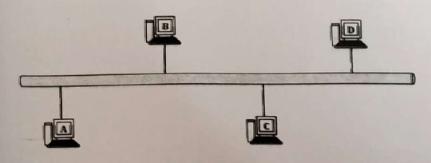
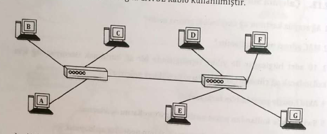

# 2. Çalışma Soruları

### 1. Ağ arayüz kartının ağ üzerindeki görevi nedir?

    - Ağ arayüz kartı, bir bilgisayarın veya başka bir cihazın bir ağa bağlanabilmesi ve ağ üzerinde veri iletimi ve alımını gerçekleştirebilmesi için gerekli olan donanım bileşenidir.

### 2. MAC adresi ne için kullanılır?

    - MAC adresi, ağ arayüz kartlarının fiziksel adresidir ve bir cihazın ağ üzerinde benzersiz bir tanımlayıcısıdır.

### 3. 10 adet bilgisayar ile yıldız topolojisinde bir ağ kurulmak isteniyor. Ağ için kullanılacak ağ cihazları ve kabloların özellikleri nelerdir?

    - Ethernet (Cat5e veya Cat6)
    - Ağ Anahtarı Bağlantı Noktaları
    - Güç Kaynağı
    - Rack veya Masaüstü Kabin

### 4. Aktif hub ile pasif hub'ın farkı nedir?

    - Aktif hub'lar sinyalleri güçlendirebilir ve genellikle daha karmaşık ağ yapılarına olanak tanırken, pasif hub'lar sinyalleri güçlendirmemektedir ve daha basit ağ bağlantıları için uygundur.

### 5. Switchlerde kullanılan paket anahtarlama modlarını açıklayınız.

    Store-and-Forward (Depola ve İlet):
        - Bu mod, bir switch'in bir paketi almadan önce tamamını depolamasını ve ardından hedefe iletmeyi sağlar.

    Cut-Through (Kes ve Gönder):
        - Bu modda, switch paketi alır almaz hedef MAC adresine bakarak paketi iletir.

    Fragment-Free (Parça Kontrollü):
        - Bu mod, switch'in paketi alır almaz sadece ilk 64 veya 68 byte'lık kısmını inceleyip, bu kısım hatasızsa paketi iletmesini sağlar.

### 6. Hub ile switch arasındaki performans farklarının nedenini açıklayınız.

    - Hub, verileri tüm bağlı cihazlara iletir. Switch sadece hedef cihaza iletir.
    - Hub'da bütün portlar aynı bant genişliğini paylaşır. Switch'te her port kendi bağlantı hızına sahip olduğundan bant genişliği daha etkili kullanılır.
    - Hub'da çakışma olursa tüm cihazlar etkilenir. Switch'te sadece sorunlu cihazlar ilgilenir.

### 7. Hub ile repeater arasında fark var mıdır?

    - Hub bir veri dağıtım cihazıdır ve veriyi aldığı port hariç tüm portlara iletirken, repeater bir sinyal güçlendirme cihazıdır ve gelen sinyalleri yeniden canlandırarak daha uzun mesafelere iletilmesini sağlar.

### 8. 3000 m^3'lik bir alanda ağ kurulamk ve internete bağlantı isteniyor. Ağ cihazlarının arasındaki mesafe maksimum 250 metre ve ağda kablosuz olarak kullanılacak cihazlar da var ise oluşturulacak ağ için kullanılacak ağ donanımları nelerdir?

    - Router
    - Switch
    - Access Point
    - Kablosuz Kontrol Cihazı
    - Ethernet Kablolar ve Fiber Optik Kablolar
    - Power over Ethernet (PoE) Switch veya Enjektörler
    - Firewall
    - Uninterruptible Power Supply

### 9. Aşağıdaki şekilde verilen ağda ince koaksiyel kablo kullanılmıştır.

    a) Ağda kullanılan donanımları yazınız.

    b) Ağda hangi fiziksel topoloji kullanılmıştır? Kullanılan fiziksel topolojiyi açıklayınız.

    c) Ağın mantıksal topolojisi nedir?

    d) Ağda kullanılan cihazlar arasında en az kaç metre mesafe olmalıdır?

    e) Ağın hızı nedir?

    f) A bilgisayarı D'ye veri göndermek istediğinde izleyeceği yol nasıldır?

### 10. Aşağıdaki şekilde verilen ağda CAT5E kablo kullanılmıştır.

    a) Ağda hangi fiziksel topoloji kullanılmıştır? Kullanılan fiziksel topolojiyi açıklayınız.

    b) Ağda kullanılan cihazlar arasında en az kaç metre mesafe olmalıdır?

    c) Merkez icihaz HUB veya Switch olduğunda ağın hızı nasıl etkilenir?

    d) Merkezi cihaz HUB veya Switch olduğunda A bilgisayarı D'ye veri göndermek istediğinde izleyeceği yol nasıldır?
