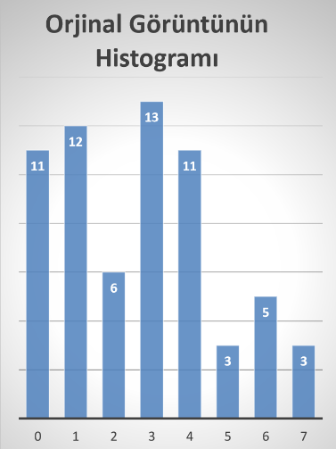
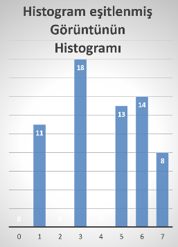

# 2. Soru

### Aşağıdaki 8x8 boyutunda ve 8 (2^3 − 3 𝑏𝑖𝑡) seviyeli gri görüntü için:

    [ 0 7 6 6 1 5 6 7 ]
    [ 0 4 5 3 4 4 4 4 ]
    [ 3 3 3 4 4 4 4 6 ]
    [ 6 7 0 1 1 3 3 3 ]
    [ 1 1 2 2 1 3 3 3 ]
    [ 3 4 2 3 2 2 1 1 ]
    [ 2 5 0 0 0 0 0 0 ]
    [ 3 4 0 1 1 1 1 0 ]

### (a) Histogramını çiziniz.

### (b) Histogram eşitleme yapınız. Eşitlenmiş imge matrisini elde ediniz.

    Pr(r0) = 11/(8*8) = 0,17
    s0 = 0,17*7 = 1,19 ≡ 1

    Pr(r1) = 12/(8*8) = 0,19
    s1 = (0,17+0,19)*7 = 2,52 ≡ 3

    Pr(r2) = 06/(8*8) = 0,09
    s2 = (,017+0,19+0,09)*7 = 3,15 ≡ 3

    Pr(r3) = 13/(8*8) = 0,20
    s3 = (0,17+0,19+0,09+0,20)*7 = 4,55 ≡ 5

    Pr(r4) = 11/(8*8) = 0,17
    s4 = (0,17+0,19+0,09+0,20+0,17)*7 = 5,74 ≡ 6

    Pr(r5) = 03/(8*8) = 0,05
    s5 = (0,17+0,19+0,09+0,20+0,17+0,05)*7 = 6,09 ≡ 6

    Pr(r6) = 05/(8*8) = 0,08
    s6 = (0,17+0,19+0,09+0,20+0,17+0,05+0,08)*7 = 6,65 ≡ 7

    Pr(r7) = 03/(8*8) = 0,05
    s7 = (0,17+0,19+0,09+0,20+0,17+0,05+0,08+0,05)*7 = 7 ≡ 7

    [ 1 7 7 7 3 6 7 7 ]
    [ 1 6 6 5 6 6 6 6 ]
    [ 5 5 5 6 6 6 6 7 ]
    [ 7 7 1 3 3 5 5 5 ]
    [ 3 3 3 3 3 5 5 5 ]
    [ 5 6 3 5 3 3 3 3 ]
    [ 3 6 1 1 1 1 1 1 ]
    [ 5 6 1 3 3 3 3 1 ]

### (c) Histogram eşitleme sonucu elde edilen yeni görüntü matrisinin histogramını çiziniz.

